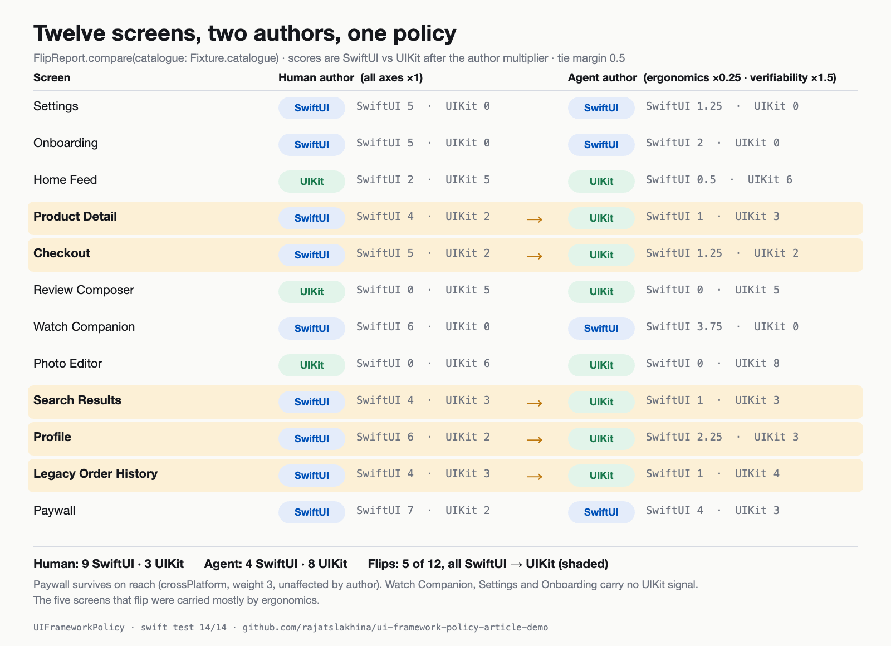

# UIFrameworkPolicy — SwiftUI vs UIKit when the author is an agent

A small, deterministic policy engine that turns the SwiftUI-vs-UIKit decision into
something a team can review in a pull request and hand to a coding agent. The idea:
the frameworks did not change much in 2026, the **author** did. SwiftUI's premium was
ergonomics; an agent author pays a fraction of that, and values verifiability more.

Article: (added after publish)



## What it shows

- `Screen` + `Trait` — a screen is a name and a set of traits (`heavyList`, `formLike`,
  `pixelExactLayout`, `crossPlatform`, …).
- `Signal` — each trait favours a `Framework` with a weight (1–3, coarse on purpose) along an
  `Axis`: `ergonomics`, `verifiability`, `control`, `performance`, `reach`.
- `AuthorProfile` — per-axis multipliers. `.human` is all ×1. `.agent` is
  `ergonomics: 0.25, verifiability: 1.5`. This is the only thing that differs between runs.
- `Evaluator.verdict(for:author:)` — sums effective weights per framework, applies a 0.5 tie
  margin, falls back to the policy default (SwiftUI). Returns the scores and sorted reasons.
- `FlipReport.compare` — runs a catalogue under both authors and lists what moved.
  `FlipReport.sweep` walks the ergonomics multiplier from 1.0 to 0.0 and counts flips.
- `AgentInstructions.render` — emits a CLAUDE.md / AGENTS.md block: default, signals with
  effective weights, per-screen verdicts, and three verification rules.
- `Fixture.catalogue` — 12 screens shaped like a mid-size commerce app.
- `UIFrameworkPolicyDemoView` — a SwiftUI screen (on purpose: it is form-like and state-driven)
  with a Human/Agent picker, per-screen verdicts, flip markers and the rendered CLAUDE.md block.

## Results (pinned by tests)

| | SwiftUI | UIKit |
|---|---|---|
| Human author | 9 | 3 |
| Agent author | 4 | 8 |

5 of 12 screens flip, all SwiftUI → UIKit: Product Detail, Checkout, Search Results, Profile,
Legacy Order History. Paywall and Watch Companion survive on `reach`.

Sweep (verifiability held at ×1.5): 0 flips at ergonomics ×1.0–0.9; 1 at ×0.85 (Legacy Order
History); 3 at ×0.60 (+ Product Detail, Search Results); 5 at ×0.25 (+ Checkout, Profile).
Raising verifiability alone flips nothing.

```swift
public static let agent = AuthorProfile(ergonomics: 0.25, verifiability: 1.5)

let report = FlipReport.compare(catalogue: Fixture.catalogue)
report.flipCount            // 5
report.count(.uiKit, for: .agent)  // 8

let block = AgentInstructions.render()   // paste into CLAUDE.md
```

The multipliers are a lead's judgment, not measurements. Change `AuthorProfile.agent`, re-run
the tests, and see which screens un-flip.

## How to run it

```bash
git clone https://github.com/rajatslakhina/ui-framework-policy-article-demo.git
cd ui-framework-policy-article-demo
swift test                       # library + 14 tests, no Xcode needed
open Demo.xcodeproj              # pick the Demo scheme, any iOS 17+ Simulator, Build & Run
```

`Demo.xcodeproj` consumes the package through a local package reference (`relativePath = .`),
so there is nothing else to fetch. No `.executableTarget` in `Package.swift`; the app lives in
its own project.

## Verification status

- `swift build`: 0 warnings, `swift test`: **14/14** on Swift 6.0.3 (Linux aarch64).
- `project.pbxproj` hand-authored; braces and parens balanced, no dangling object ids.
- **Simulator run: not completed in the session that built this repo.** That session was an
  unattended scheduled run in which desktop control (Xcode/Simulator) could not be granted, so
  there is no app screenshot yet — see `Demo/Screenshots/README.md`. The demo view was reviewed
  by hand against the iOS 17 SwiftUI APIs it uses (`NavigationStack`, `List`,
  `Picker(.segmented)`, `LabeledContent`, `.sheet(item:)`).

## Layout

```
Package.swift
Sources/UIFrameworkPolicy/   Model, Policy, FlipReport, AgentInstructions, Fixture, DemoView
Tests/UIFrameworkPolicyTests/
Demo.xcodeproj/              app project + shared Demo scheme
Demo/                        DemoApp.swift, Assets.xcassets, Screenshots/
Article/                     the figures used in the Medium article
```

MIT licence.
